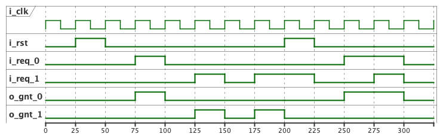

# Arbiter

<!-- 
@startuml timing-diagram.png

clock   "i_clk"   as C0 with period 25
binary  "i_rst" as RST
binary  "i_req_0" as R0
binary  "i_req_1" as R1
binary  "o_gnt_0" as G0
binary  "o_gnt_1" as G1

@0

@+25
RST is high

@+25
RST is low

@+25
R0  is high
G0 is high

@+25
R0  is low
G0 is low

@+25
R1  is high
G1 is high

@+25
R1  is low
G1 is low

@+25
R1  is high
G1 is high

@+25
RST is high
G0  is low
G1  is low

@+25
R1 is low
RST is low

@+25
R0  is high
G0 is high

@+25
RST is low
R0  is high
R1  is high
G0 is high

@+25
R0 is low
R1 is low
G0 is low

@enduml
 -->

